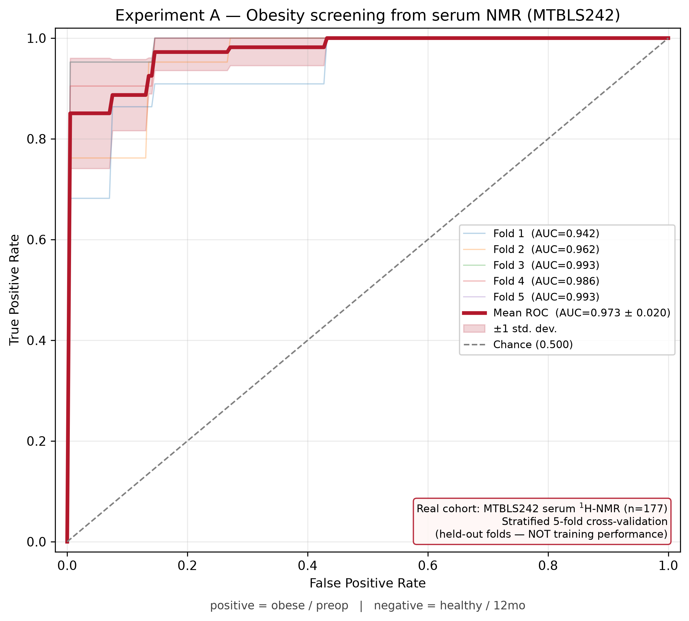
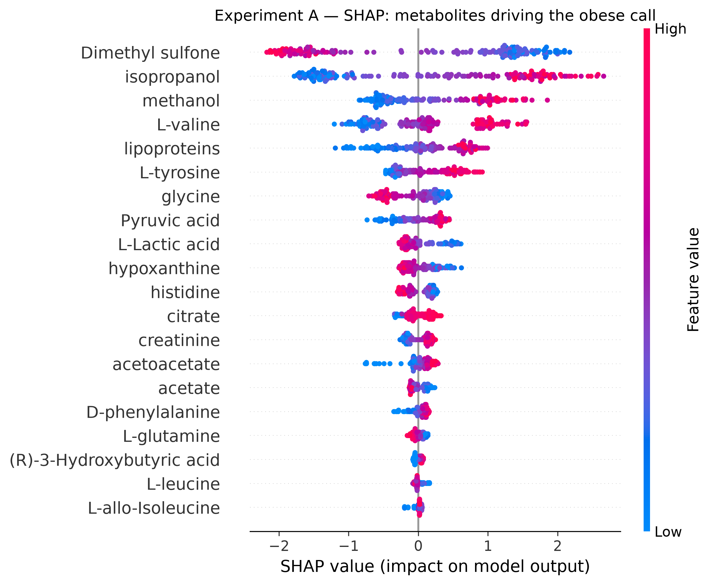
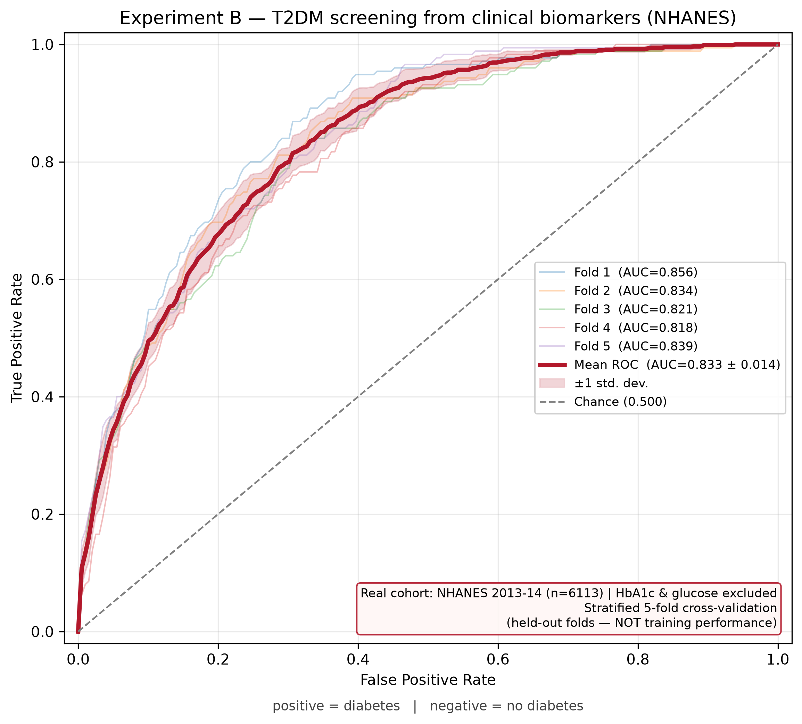
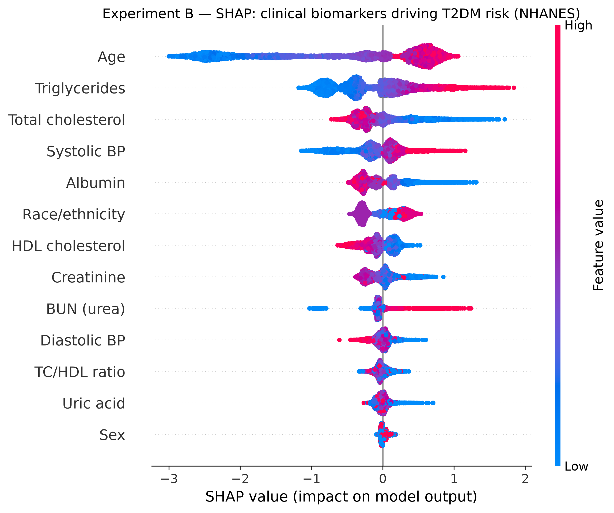
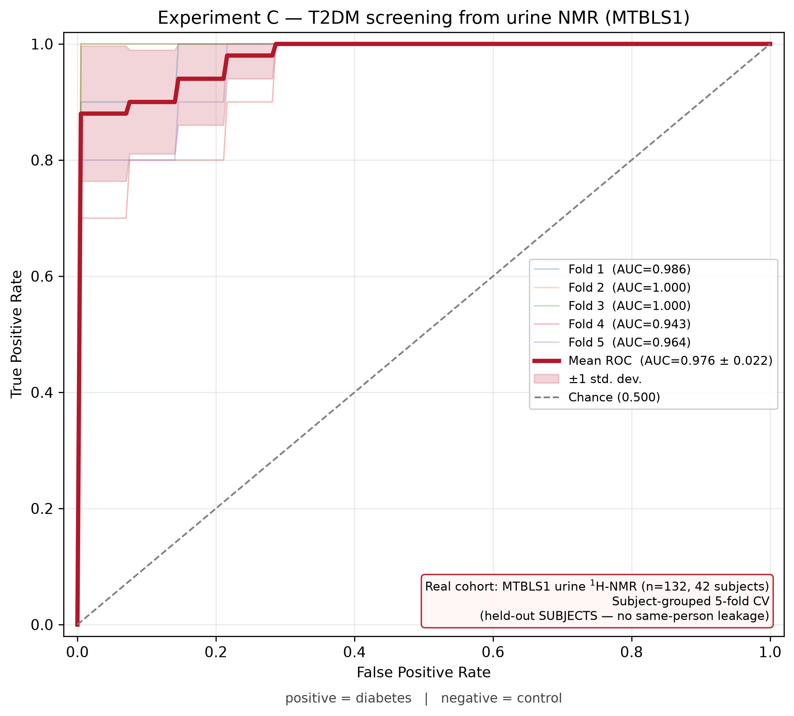
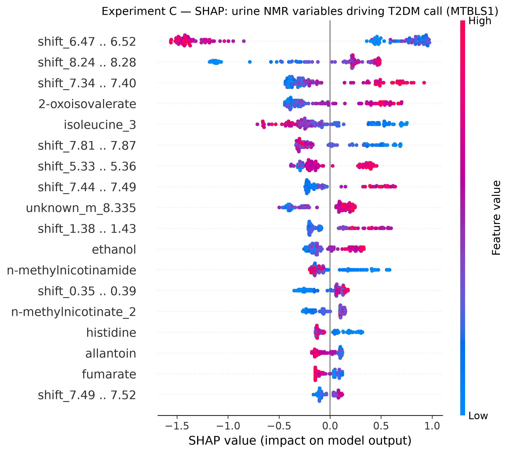

# PhenoInsure — NMR & Clinical Metabolic Screening
## Poster documentation — every experiment & every figure

BDI Hackathon 2026 · Phenome Track · PhenoInsure Tech · Calvin (KMITL AI Engineering)
Environment: `superaiss6` · All figures 300 DPI (print-ready)

---

## The one-line story

> **Three honest metabolic screeners on real cohorts, each measured on held-out data.**
> Obesity from a serum NMR fingerprint (**Exp A, AUC 0.97**), Type-2 Diabetes from routine
> clinical labs (**Exp B, AUC 0.83**), and Type-2 Diabetes from a urine NMR fingerprint
> (**Exp C, AUC 0.98, subject-grouped**) — every ROC states *where the data came from* and
> *how it was measured*, so the numbers survive scrutiny.

| Exp | Question | Cohort (real) | Eval | AUC |
|---|---|---|---|---|
| A | NMR → obesity | MTBLS242 serum, n=177 | 5-fold CV | 0.973 ± 0.020 |
| B | clinical → T2DM | NHANES 2013-14, n=6,113 | 5-fold CV | 0.833 ± 0.014 |
| C | NMR → T2DM | MTBLS1 urine, n=132 (42 subj) | subject-grouped CV | 0.976 ± 0.022 |

### Why these results are defensible (read this before the judges ask)
1. **Real cohorts only.** MTBLS242 & MTBLS1 (measured NMR) and NHANES (US national survey).
   No simulated spectra. A "leak-free" model on *synthetic* data is only *pipeline
   validation*, not evidence a biomarker is real.
2. **Held-out AUC, stated on the figure.** Every ROC is cross-validation (mean ± std over
   folds) — never training performance, never feature-importance dressed up as prediction.
   Exp C holds out whole *subjects*, not just samples.
3. **Leakage-free labels.** Exp B excludes the biomarkers that define the label (HbA1c,
   glucose); Exp C's NMR excludes the glucose region. Honest numbers, not circular ~1.0.

---

# Experiment A — Obesity screening from serum NMR (MTBLS242)

## 1. ข้อมูลจากไหน — Data source
- **Cohort:** MetaboLights **MTBLS242** — a **bariatric (weight-loss) surgery** study.
  Serum ¹H-NMR spectroscopy, **465 samples**, **21 quantified metabolites**.
- **Files:** `MTBLS242_parsed.npz` (concentrations 465×21 + sample IDs), joined to
  `MTBLS242_samples.txt` on `Sample Name` → time-point factor.
- **Label idea:** patients start morbidly obese and lose weight over 12 months, so the
  time point *is* an obesity axis. We take the two extremes:

  | Class | Time point | n |
  |---|---|---|
  | **obese** (1) | `preop` (before operation) | **106** |
  | **healthy** (0) | `12 months after surgery` | **71** |

  Intermediate 3 / 6 / 9-month samples (mid-weight-loss, ambiguous) are **excluded**.
  **Total n = 177.** This is a *measured* cohort — not simulated.

## 2. ใช้วิธีอะไร — Method
- **Features:** 21 NMR metabolite concentrations, `log1p`-transformed (compresses NMR
  abundance dynamic range, keeps zeros valid).
- **Model:** XGBoost — `max_depth=3` (shallow, because n is small), 200 trees, lr 0.05,
  subsample/colsample 0.8.
- **Evaluation:** **stratified 5-fold cross-validation.** ROC built from *held-out* fold
  predictions, interpolated to a common grid and averaged.
- **Interpretation:** SHAP (TreeExplainer) on a model fit to all 177 samples.

## 3. ผลยังไง — Results
**Mean ROC-AUC = 0.973 ± 0.020** (stratified 5-fold CV)

| Fold | n test | AUC |
|---|---|---|
| 1 | 36 | 0.942 |
| 2 | 36 | 0.962 |
| 3 | 35 | 0.993 |
| 4 | 35 | 0.986 |
| 5 | 35 | 0.993 |

### Figure 1 — ROC / AUC curve (`fig1_obesity_nmr_roc_auc.png`)



**What it shows:** the classifier's true-positive vs false-positive trade-off. Five thin
lines = the five held-out folds; the **bold red line = mean ROC**, the pink band = ±1 std
across folds, the grey dashed diagonal = random chance (AUC 0.5). The curve hugs the
top-left corner → strong separation of obese vs healthy from the NMR fingerprint alone.
**How to read the annotations:** the red box (bottom-right) names the data source
(*Real cohort: MTBLS242 serum ¹H-NMR, n=177*) and the evaluation method
(*Stratified 5-fold CV — held-out, NOT training*). The caption under the axis fixes the
label direction: *positive = obese/preop, negative = healthy/12mo*.

### Figure 2 — SHAP metabolite drivers (`fig2_obesity_nmr_shap.png`)



**What it shows:** each dot is one patient; horizontal position = that metabolite's push
toward "obese" (right) or "healthy" (left); colour = the metabolite's value (red high,
blue low). Metabolites are ranked by mean |impact|. Top drivers (mean |SHAP|):

| Rank | Metabolite | mean\|SHAP\| | Biological read |
|---|---|---|---|
| 1 | Dimethyl sulfone | 1.43 | ⚠ **exogenous** (supplement / gut-microbial) — confounder |
| 2 | isopropanol | 1.30 | ⚠ **exogenous** — surgical skin-prep contaminant |
| 3 | methanol | 0.65 | ⚠ **exogenous** (diet / gut flora / handling) — confounder |
| 4 | L-valine | 0.61 | ✅ **BCAA** — earliest insulin-resistance NMR marker |
| 5 | lipoproteins | 0.44 | ✅ dyslipidemia / VLDL remodeling in obesity |
| 6 | L-tyrosine | 0.36 | ✅ aromatic amino acid, ↑ in obesity/IR |
| 7 | glycine | 0.31 | ✅ ↓ in insulin resistance (inverse marker) |
| 8 | Pyruvic acid | 0.26 | ✅ glycolytic flux, altered in metabolic dysfunction |

## ⚠ Honest read (say this before someone else does)
1. **Easy contrast.** preop vs 12mo are the cohort extremes → high AUC expected. This
   measures separability of the extremes, not general population screening power.
2. **Exogenous confounders lead SHAP.** The top 3 (dimethyl sulfone, isopropanol, methanol)
   are not obesity biology. **Isopropanol is a surgical skin-prep contaminant** — preop
   bloods are drawn in a surgical setting, 12-month samples at outpatient follow-up, so part
   of the separation is *sample context, not metabolism*.
3. **Real biology is present too** — L-valine (BCAA), lipoproteins, L-tyrosine, glycine,
   pyruvate all shift legitimately with obesity/insulin resistance.
4. **Repeated measures.** Patient IDs aren't recoverable from `sample_ids`, so same-patient
   leakage across folds can't be fully excluded.
5. **Robustness check available:** re-run dropping the 3 exogenous compounds — if AUC holds,
   the metabolic signal is real; if it collapses, the 0.97 was largely sample-context artifact.

---

# Experiment B — Type-2 Diabetes screening from clinical biomarkers (NHANES)

## 1. ข้อมูลจากไหน — Data source
- **Cohort:** **NHANES 2013–2014 (Cycle H)** — US CDC national health & nutrition survey.
- **Merge:** 7 real exam/lab files joined on respondent id `SEQN`: `DEMO_H` (age, sex, race),
  `BPX_H` (blood pressure), `TCHOL_H` + `HDL_H` (cholesterol), `BIOPRO_H` (creatinine,
  albumin, BUN, triglycerides, uric acid), `GHB_H` (HbA1c — *label only*), `DIQ_H`
  (diagnosis — *label only*).
- **Label:** `diabetes = (self-reported diagnosis DIQ010==1) OR (HbA1c ≥ 6.5%)`, adults ≥18.
- **Cohort size:** **6,113 adults**, **875 positives**, **prevalence 14.3%.**

## 2. ใช้วิธีอะไร — Method
**Leakage-free screening.** The label is *defined* by HbA1c and diagnosis, so those are
excluded from features. We also **exclude fasting glucose** (near-diagnostic). The model
screens from **13 routine, non-diagnostic signals**:

`age, sex, race, systolic BP, diastolic BP, total cholesterol, HDL, TC/HDL ratio,
creatinine, albumin, BUN, triglycerides, uric acid`

An `assert` in the notebook enforces that `LBXGH` (HbA1c), `LBXSGL` (glucose) and `DIQ010`
never enter the feature matrix.
- **Model:** XGBoost, `max_depth=3`, 300 trees, lr 0.05.
- **Evaluation:** **stratified 5-fold cross-validation** (held-out folds).

## 3. ผลยังไง — Results
**Mean ROC-AUC = 0.833 ± 0.014** (stratified 5-fold CV, leakage-free)

| Fold | n test | AUC |
|---|---|---|
| 1 | 1223 | 0.856 |
| 2 | 1223 | 0.834 |
| 3 | 1223 | 0.821 |
| 4 | 1222 | 0.818 |
| 5 | 1222 | 0.839 |

### Figure 3 — ROC / AUC curve (`fig3_t2dm_nhanes_roc_auc.png`)



**What it shows:** same construction as Figure 1 — five held-out folds, bold mean ROC, ±1
std band, chance diagonal. Tight fold spread (band is narrow) because n is large (~1,220 per
test fold). **Annotation** states *Real cohort: NHANES 2013-14 (n=6113) | HbA1c & glucose
excluded* and *Stratified 5-fold CV — held-out, NOT training*; axis caption fixes
*positive = diabetes, negative = no diabetes*.

### Figure 4 — SHAP biomarker drivers (`fig4_t2dm_nhanes_shap.png`)



**What it shows:** which routine biomarkers the model leans on (same beeswarm format as Fig 2
— dot = patient, right = pushes toward "diabetes", colour = value red-high/blue-low). SHAP
explains *which* signals are used; it does **not** measure predictive power — that's the ROC.
The ranking is clinically coherent, which is the point: with HbA1c/glucose removed, the model
recovers the textbook metabolic-syndrome axis rather than a leakage shortcut.

| Rank | Biomarker | mean\|SHAP\| | Direction & clinical read |
|---|---|---|---|
| 1 | **Age** | 1.03 | older → higher risk; dominant T2DM epidemiological driver |
| 2 | **Triglycerides** | 0.47 | high → higher risk; core dyslipidemia / metabolic syndrome |
| 3 | Total cholesterol | 0.31 | contributes; direction confounded by lipid-lowering therapy |
| 4 | **Systolic BP** | 0.26 | high → higher risk; hypertension clusters with T2DM |
| 5 | Albumin | 0.26 | low → higher risk (poorer metabolic/renal status) |
| 6 | Race/ethnicity | 0.25 | captures known T2DM prevalence disparities |
| 7 | **HDL cholesterol** | 0.17 | low HDL → higher risk (classic metabolic-syndrome marker) |
| 8 | Creatinine | 0.17 | renal function (diabetic nephropathy signal) |
| 9 | BUN (urea) | 0.11 | high → higher risk; renal axis |
| 10–13 | Diastolic BP, TC/HDL, Uric acid, Sex | ≤0.08 | minor contributors |

**Talking point:** the top drivers (age, triglycerides, blood pressure, HDL) are exactly what
a clinician weighs for diabetes risk — evidence the 0.83 AUC is *real screening skill*, not a
leaked shortcut.

## Honest read
- **AUC ≈ 0.83 is the *honest* number.** Keeping HbA1c/glucose would push it to ~1.0, but
  that is circular — those biomarkers define the label. 0.83 reflects genuine screening from
  routine signals (age, BP, lipids, kidney markers) for people not yet lab-diagnosed — the
  business case for pre-clinical screening.
- Real cohort + real label + held-out folds → trustworthy.

---

# Experiment C — Type-2 Diabetes screening from urine NMR (MTBLS1)

## 1. ข้อมูลจากไหน — Data source
- **Cohort:** MetaboLights **MTBLS1** — *"A metabolomic study of urinary changes in type 2
  diabetes in human compared to the control group."* Human **urine ¹H-NMR** (Bruker 700 MHz).
- **Label** (`Factor Value[Metabolic syndrome]`): **48 diabetes** vs **84 control** samples,
  from 12 healthy volunteers (7 time points each) + 30 T2DM patients (1–3 each) = **42 people**.
- **132 samples × 220 NMR variables** (115 identified metabolites + 105 unassigned buckets).
- **This is the honest NMR→diabetes design:** NMR spectrum *and* diabetes label are measured on
  the **same person** — exactly what the NHANES fusion could never be.
- **No glucose shortcut:** the NMR bucketing *excludes the glucose and urea regions*.

## 2. ใช้วิธีอะไร — Method
- **Features:** 220 NMR variables, `log1p`. **Model:** XGBoost `max_depth=3`, 200 trees.
- **The important part — subject-grouped CV.** Patients give up to 7 repeated urine samples, so a
  naive split leaks the *same person* into train and test. We reconstruct subjects from runs of
  consecutive sample numbers (controls → **12 clean blocks of 7**, matching the paper) and use
  **StratifiedGroupKFold** — each fold holds out whole *subjects*.

## 3. ผลยังไง — Results
**Subject-grouped mean ROC-AUC = 0.976 ± 0.022** (held-out subjects)

| Fold | n test | AUC |
|---|---|---|
| 1 | 24 | 0.986 |
| 2 | 30 | 1.000 |
| 3 | 30 | 1.000 |
| 4 | 24 | 0.943 |
| 5 | 24 | 0.964 |

**Leakage check:** subject-grouped **0.976** vs naive-stratified **0.986** — nearly identical, so
the signal separates diabetes across *different people*, not by memorising individual fingerprints.

### Figure 5 — ROC / AUC curve (`fig5_t2dm_nmr_roc_auc.png`)



Same construction as Fig 1/3, but the annotation reads **"Subject-grouped 5-fold CV (held-out
SUBJECTS — no same-person leakage)"** — the honest evaluation for a repeated-measures cohort.

### Figure 6 — SHAP NMR drivers (`fig6_t2dm_nmr_shap.png`)



**Biologically coherent — the payoff.** Top identified drivers are textbook T2DM urinary markers:

| Driver | Read |
|---|---|
| **2-oxoisovalerate**, **isoleucine** | ✅ branched-chain amino acids / keto-acids — the canonical insulin-resistance signature |
| aromatic buckets (7.3–7.9 ppm) | ✅ consistent with **hippurate** (gut-microbial marker, shifts in T2DM) |
| **N-methylnicotinamide / N-methylnicotinate** | ✅ NAD⁺ / niacin metabolism, altered in T2DM |
| **allantoin** | ✅ oxidative-stress marker, ↑ in diabetes |
| **fumarate**, **histidine** | ✅ TCA-cycle / amino-acid shifts |
| ethanol | ⚠ exogenous (diet/handling) confounder |

**Talking point:** with glucose excluded, a real single-cohort NMR model recovers the *known*
diabetes metabolome (BCAAs, hippurate, NAD metabolism) — real biomarker evidence, not fabrication.

## Honest read
- **AUC ≈ 0.98 (subject-grouped) is a genuine single-cohort NMR→T2DM result.**
- **Caveats:** small (42 people / 26 conservative subject-groups); **urine**, not serum (different
  matrix from Exp A/B); diabetic subject boundaries are approximate (conservative consecutive-run
  heuristic); T2DM patients here were diet-controlled with normal blood glucose.

---

# What we deliberately do NOT show (and why)
The NHANES↔NMR **fusion** (Exp 006/007 + the "+Attention" conditions, in `../../pundata_py/`) is
**not real evidence** — on two counts, both verified in the code:

1. **The "+NMR score" (AUC ≈ 0.91)** attaches NMR to NHANES people by *sampling from an MTBLS242
   distribution* — in `3_fusion_pipeline.ipynb` by label (`np.where(label==1, disease_dist,
   healthy_dist)`), which is **direct label leakage by construction** (score↔label corr ≈ 0.47
   built in). Different cohorts, no shared individuals.
2. **The "+Attention" features** (`5_comparison_report.ipynb`) read self-attention weights off a
   *mostly-constant, fabricated* 21-metabolite proxy (≈6 NHANES labs pasted into named slots, 13
   slots constant), from a transformer trained on abundance-rank — not diabetes. They correlate
   ≈0 with diabetes and **lower** AUC (**C: +Attention 0.808 < A: NHANES-only 0.817**). They add
   no information.

**The only honest salvage** of the attention work is the **within-cohort coupling map on real
MTBLS242** (lipoproteins as the metabolite attention hub) — presented as **EDA / hypothesis
generation**, never as a diabetes predictor. A true NMR+clinical fusion needs *linked*
measurements on the same people (e.g. **UK Biobank NMR**), which this project does not have.
**Experiment C above is the honest thing the fusion was reaching for.**

---

# Judge Q&A prep
- **"How did you measure AUC?"** → Stratified 5-fold cross-validation, held-out folds, mean ±
  std. Stated on every figure.
- **"Isn't 0.97 too good?"** → Yes, and we say so: preop vs 12mo are cohort extremes; SHAP
  shows exogenous confounders (isopropanol = skin-prep). The honest, generalizable number is
  the NHANES 0.83.
- **"Why is diabetes AUC lower than obesity?"** → Because we *removed* the label-defining
  biomarkers (HbA1c, glucose). 0.83 is real screening skill, not leakage.
- **"Is the NMR real?"** → Yes. Obesity (Exp A) uses measured MTBLS242 serum NMR; T2DM/NMR
  (Exp C) uses measured MTBLS1 urine NMR — both single real cohorts where the same person has
  NMR *and* the label. The NHANES model (Exp B) is clinical-only; we do **not** claim a
  cross-cohort NMR+clinical fusion.
- **"Can NMR predict diabetes?"** → Yes, honestly, on MTBLS1 (Exp C): subject-grouped AUC 0.976,
  glucose region excluded, SHAP recovers BCAAs/hippurate/NAD metabolism. Evaluated on held-out
  *subjects* (not just samples) so it isn't memorising repeated measures.

---

# Reproduce
```bash
conda run -n superaiss6 jupyter nbconvert --to notebook --execute --inplace \
  ../exp_obesity_nmr_mtbls242.ipynb ../exp_t2dm_clinical_nhanes.ipynb ../exp_t2dm_nmr_mtbls1.ipynb
```
Figures in this folder are 300 DPI regenerations of the notebook outputs (identical numbers).

| File | Figure |
|---|---|
| `fig1_obesity_nmr_roc_auc.png` | Exp A — obesity ROC/AUC (0.973 ± 0.020) |
| `fig2_obesity_nmr_shap.png` | Exp A — SHAP metabolite drivers |
| `fig3_t2dm_nhanes_roc_auc.png` | Exp B — T2DM ROC/AUC (0.833 ± 0.014) |
| `fig4_t2dm_nhanes_shap.png` | Exp B — SHAP clinical-biomarker drivers |
| `fig5_t2dm_nmr_roc_auc.png` | Exp C — T2DM/NMR ROC/AUC (0.976 ± 0.022, subject-grouped) |
| `fig6_t2dm_nmr_shap.png` | Exp C — SHAP urine-NMR drivers |
